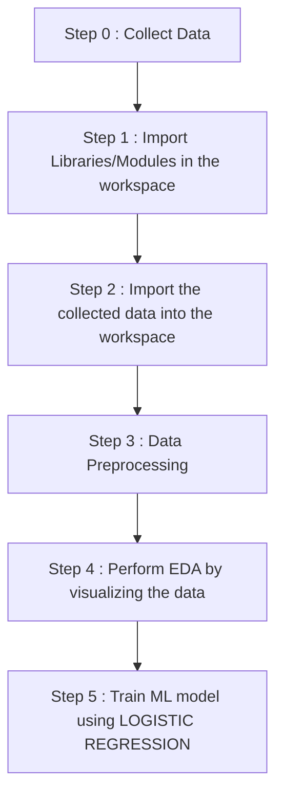

# Heart-Disease-Prediction-System-
This a ML program which predicts whether a person has a heart disease or not on the basis of the different parameters like cholestrol, age, sex etc.

Dataset Link : https://tinyurl.com/5xdhhswy

<h1 align='center'> WORKFLOW OF THE PROJECT</h1>



<ol>
  <li><b><i>DATA COLLECTION</i></b> - The SONAR data used in the above project is collected from kaggle. <br>Link : https://tinyurl.com/ybm7fpwp<br>
  <li><b><i>SETTING UP WORKSPACE/ENVIRONMENT</i></b> - This basically means importing of all the required modules and importing the data.<br>
  Modules used in this project : 
  
  ```
    import numpy as np                                          #to convert data into numpy arrays
    import pandas as pd                                         #for data pre-processing technique and importing our data
    import matplotlib.pyplot as plt                             #for creating data visualizations to explore the data
    import seaborn as sns                                       #for making such visualizations and creating plots
    from sklearn.model_selection import train_test_split        #to divide our original data into training data and testing data
    from sklearn.linear_model import LogisticRegression         #to build our regression type ml model from sklearn import metrics 
    from sklearn.metrics import accuracy_score                  #to evaluate the accuracy of our ml model
  ```
  
  <li><b><i>DATA PRE-PROCESSING</b></i> - This step involves the set of different processes like data cleaning, data integration and other such processes which basically means removing noise and inconsistency from the data.
    
  <li><b><i>TRAIN TEST SPLIT</b></i> - This is the crucial step where we divide the dataset into two halves called "Training data" and "Testing data". This helps to test the accuracy score of the model which going to be developed and trained.
    
   ```
    X_train, X_test, Y_train, Y_test = train_test_split(X, Y, test_size=0.2, statify = Y, random_state=2)
   ```
  
 <li><b><i>LOGISTIC REGRESSION MODEL</b></i> - This is a main model which we were talikng about. We chose "Logistic Regression Model out of all other models because we need a model which answers in only two ways either it is not a Healthy Heart([1]) or it is a healthy heart([0])."
</ol>

    
###  In this way we can predict the condition of person's heart whether it is healthy or not. The prediction can be done more accurately if used neural networks and huge dataset and deep learning .
